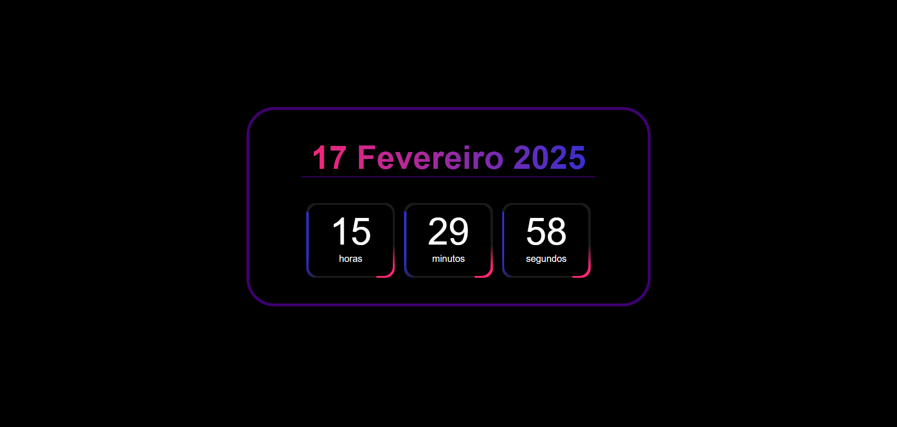

# ⏳ Relógio Digital

Um relógio digital estilizado com **efeito neon**, que exibe as horas, minutos e segundos em tempo real, além da data atual.

## 📌 Tecnologias utilizadas

- HTML
- CSS
- JavaScript

## 🎨 Captura de tela



## 🚀 Como executar o projeto

1. Clone este repositório:

```sh
 git clone https://github.com/AkiroSetonai/Digital-Clock.git
```

2. acesse a pasta do projeto:

```sh
 cd Digital-Clock
```
